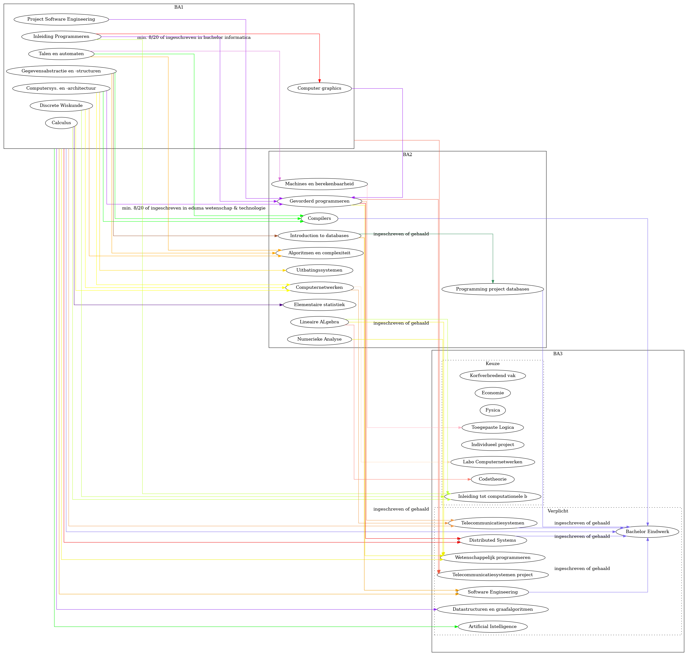

# volgtijdelijkheid-informatica
Overzicht welke vakken je behaald moet hebben (of minstens 8/20) om een ander vak op te nemen binnnen informatica aan de UAntwerpen. Indien er geen label bijstaat, is de vereiste om min. 8/20 behaald te hebben. 



## Disclaimer
Deze graaf kan fouten bevatten. Check steeds Sisa voor de meest up to date versie zonder menselijke fouten. Deze versie is gemaakt op 14 februari 2021. Sorry voor het gebruik van lichte kleuren, het maakt het toch iets overzichtelijker dan alleen maar zwarte lijnen (je kan ```informatica.dot``` ook openen in xdot om over nodes te hoveren, zodat alle edges rood worden).

## Source
De info is gehaald van Sisa > Studieprogramma > Inschrijven via modeltraject > Kies een vak > Meer details > Inschrijvingsgegevens > Vereiste

## Usage
```shell
dot -Tpng informatica.dot -o informatica.png
```
## Automatisatie
Het zou handig zijn als een scriptje automatisch deze graaf genereert (m.b.v. Selenium), maar dit is onmogelijk (of toch heel moeilijk), aangezien de tekst voor de vereiste niet altijd dezelfde structuur heeft. 